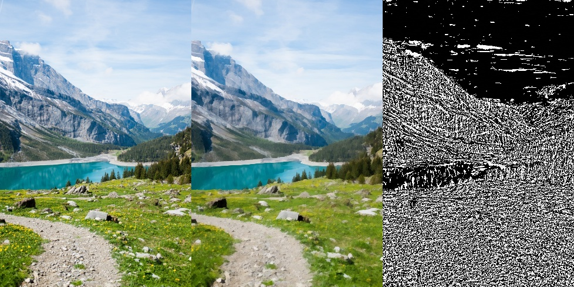
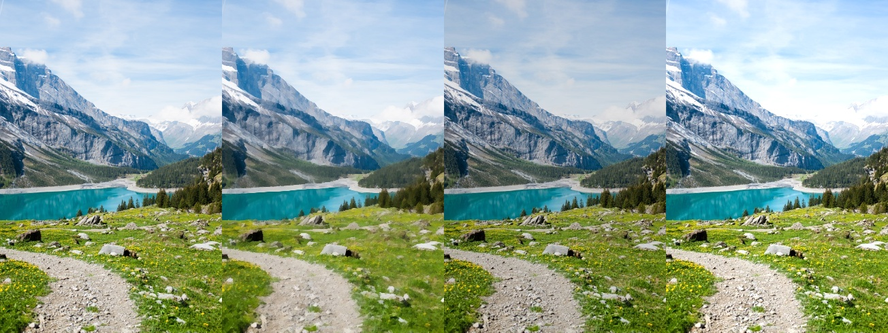
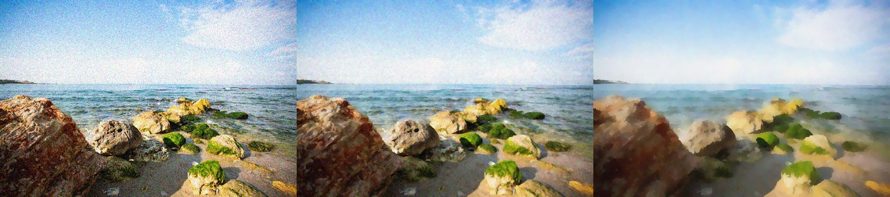
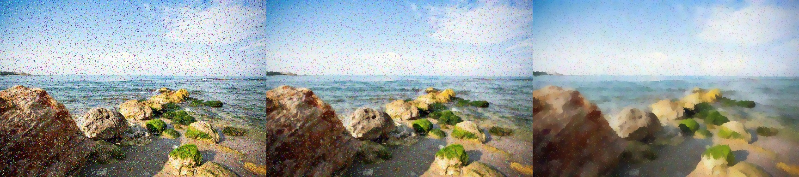
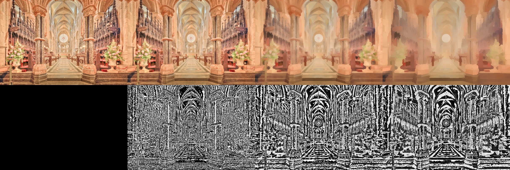

## Edge-preserving Multiscale Image Decomposition based on Local Extrema
Implement Edge-preserving Multiscale Image Decomposition based on Local Extrema

### Prerequisites
* python 3

### Usaege
 ```shell
    python3 smoothing.py <ImagePath>, <KernelSize>, <Iteration>
 ```
ex: python3 smoothing.py Original.jpg 3 1

### Output
* left: Original image
* middle: Smoothed image(result)
* right: Detail layer

### Explanation
There are 6 sample images in total. (sample1.jpg – sample6.jpg)
1. Utilize default setting to each image (kernel size:3, iteration: 1)
Result image name: samplex_smooth.jpg

<p align='center'>
  
    <br>
    <em> Fig. 1: sample1_smooth </em>
</p>

Left to right: original image(I), smoothed image(M), detail layer (D = I-M on Y channel)

2. Image Enhancement: sample1 sample6
Method: Unsharp Masking --- combination of all-pass and low-pass filters

<p align='center'>
  
    <br>
    <em> Fig. 2: sample1_enhancement095_105 </em>
</p>

Left to right: original image, smoothed image, enhancement image1, enhancement image2

3. Noise Removal: sample2 sample3
Apply Gaussian noise and Salt and pepper noise to each image

<p align='center'>
  
    <br>
    <em> Fig. 3: sample2_gauss_remove </em>
</p>

Left to right: noisy image, 1st iteration smoothing, 2nd iteration smoothing

<p align='center'>
  
    <br>
    <em> Fig. 4: sample2_sp_remove </em>
</p>

Left to right: noisy image, 1st iteration smoothing, 2nd iteration smoothing

4. Multiple Iterations: sample4 sample5
<p align='center'>
  
    <br>
    <em> Fig. 5: sample4_3iterations </em>
</p>

From left to right, top to bottom: original(I), 1st iteration smoothing(M1), 2nd iteration smoothing(M2), 3rd iteration smoothing(M3), none, 1st detail layer(D1 = I-M1), 2nd detail layer(D2 = M1-M2), 3rd detail layer(D3= M2– M3)
